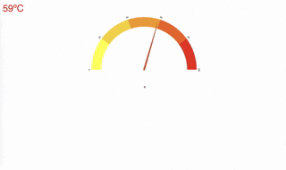

# temp_reader
temp_reader is an app that displays an auto-updating web page with the current room temperatue read from a raspberry pi.

The backend is a flask app that serves up a webpage with a socketio connection which receives the current temperature at a configurable interval. 

The webpage displays the current temperature in either blue (for cold) or red (for hot). D3.js is used to also display the temperature in a temperature gauge.  

### Installation
First install a python 3.7 virtual environment using whatever way you want and activate it.
    
    git clone https://github.com/xkal36/temp_reader
    pip install -r requirements.txt
   
### Running
    python app.py 10

In the above example, the temperature will be read and sent to the browser every 10 seconds.

### Demo

### To check for connected equipment:

    pi@raspberrypi:~/temp_reader $ sudo modprobe w1-gpio
    pi@raspberrypi:~/temp_reader $ sudo modprobe w1-therm
    pi@raspberrypi:~/temp_reader $ ls /sys/bus/w1/devices/
    00-200000000000  00-c00000000000  w1_bus_master1
    
One of those should start with `28` if it’s connected

### Equipment tutorial

http://www.circuitbasics.com/raspberry-pi-ds18b20-temperature-sensor-tutorial/

